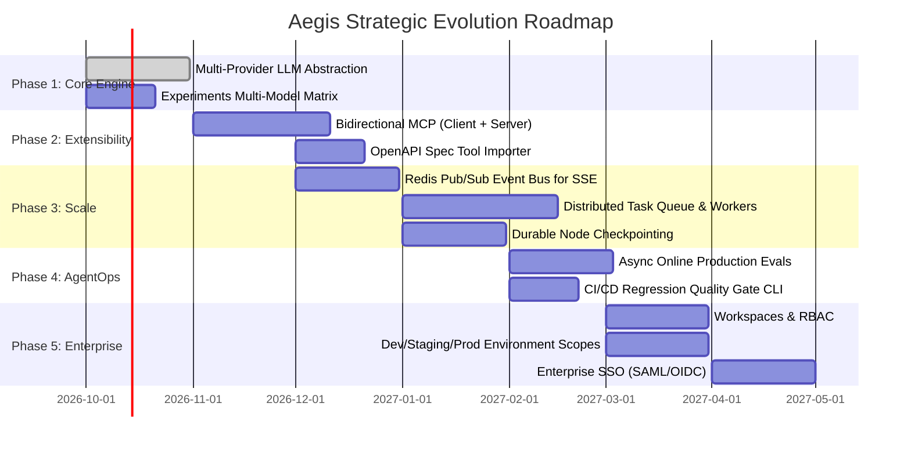

# Aegis — Enterprise Future Plan: Unified Visual AgentOps Platform

> **Vision:** The unified "n8n + LangSmith" platform for enterprise AI agents.  
> Visual graph authoring, execution, safety guardrails, evaluations, and deep observability combined in a single application.

---

## 1. Executive Summary & North Star

### The Market Dilemma
Today's enterprise AI agent teams are forced into a fragmented two-tier stack:
1. **Visual Automation Builders (n8n, Make, Dify, Flowise):** Intuitive graph builders and control flow, but fundamentally **blind** to LLM internals (no nested span waterfalls, no prompt regression gates, no semantic drift monitoring, naive token accounting).
2. **AgentOps & Observability Platforms (LangSmith, Braintrust, Arize Phoenix):** World-class tracing, evaluation datasets, and LLM-as-a-judge rubrics, but **code-first / SDK-only**—they lack an interactive visual canvas where non-engineers or product teams can author, branch, and deploy autonomous multi-agent graphs.

### The Aegis North Star
**Build → Guard → Grade → Operate** in a continuous loop:
* **Author** complex multi-agent DAGs visually with code sandboxes, routers, and sub-workflows.
* **Harden** with automated PII redaction, prompt injection detection, and content safety policies.
* **Grade** against golden test datasets with multi-metric LLM judges before promoting versions.
* **Operate** in production with live nested trace waterfalls, token/cost tracking, automated failure clustering, and anomaly alerts.

---

## 2. Current Foundation vs. Enterprise Scale (Scorecard)

| Dimension | Aegis Today | Enterprise "n8n + LangSmith" Target | Gap / Priority |
| :--- | :--- | :--- | :--- |
| **Workflow Canvas** | React Flow, 30+ nodes (Triggers, Routers, Code, Iteration, Sub-workflows, HITL) | Dynamic schema inference, edge-splice insertion, undo/redo, real-time collaboration | **P1** Authoring polish |
| **LLM Engine** | Multi-provider via `app/services/llm_providers/` + LiteLLM: Gemini native; OpenAI, Anthropic, Fireworks, OpenRouter, Featherless, Vercel AI Gateway | Remaining: Bedrock, Azure, Ollama/local models; multi-model matrix in Experiments | **Done 2026-09** · leftovers P1 |
| **Integrations** | 4 native connectors (Slack, Discord, Email, Postgres) + HTTP | Bidirectional MCP (Client + Server), OpenAPI 3.0 auto-generator, OAuth connector store | **P0** Critical reach |
| **Runtime Scaling** | Single-process asyncio; in-memory SSE broker (`_RunEventBroker`) and memory-locked HITL | Distributed execution (Redis Pub/Sub event bus, Celery/ARQ/Temporal workers, durable checkpointing) | **P0** Scale architecture |
| **Evaluation** | Offline batch experiments, golden datasets, synchronous inline eval nodes | Asynchronous online evaluation (sampling live traffic), automated dataset synthesis from errors | **P1** LangSmith parity |
| **Observability** | Nested `RunSpan` waterfall, token & USD cost tracking, hourly rollups, failure clusters | Trace search/querying, semantic latency heatmaps, user session replay, OTel distributed trace export | **P1** Ops depth |
| **Governance & Security** | Single API-key auth (`X-Aegis-API-Key`), Fernet secret encryption | Multi-tenant organizations, Workspaces, RBAC (Builder, Reviewer, Operator), SAML/SSO, Env promotion | **P1** Enterprise sales |

---

## 3. Core Architectural Pillars

### Pillar 1: Multi-Provider Model Abstraction (Vendor Neutrality)
* **Status: shipped 2026-09** (PRs #51/#52) — `app/services/llm_providers/` is the single seam; Gemini via native `google-genai`, OpenAI/Anthropic/Fireworks/OpenRouter/Featherless/Vercel AI Gateway via LiteLLM; per-node provider/model selection with credential-bound keys and env fallback.
* **Objective:** Remove single-vendor Gemini lock-in without discarding Google ADK strengths.
* **Remaining design:**
  * Add Bedrock, Azure OpenAI, and Ollama/local providers to `llm_providers/registry.py`.
  * Multi-provider matrix in **Experiments / Compare Mode** (e.g. benchmark Gemini 2.5 vs. Claude 3.5 Sonnet on the same golden dataset) — today providers compare by editing node configs.

### Pillar 2: Distributed, Resilient Execution Fabric (Horizontal Scaling)
* **Objective:** Scale beyond a single container; enable hundreds of concurrent agent runs without split-brain or dropped event streams.
* **Design:**
  * **Distributed Event Bus:** Replace in-memory `_RunEventBroker` in `executor.py` with **Redis Pub/Sub** (or PostgreSQL `LISTEN/NOTIFY`). Any frontend client can subscribe to SSE streams on any web pod.
  * **Distributed Task Workers:** Decouple API server from run execution via worker pools (e.g. Celery / ARQ / Redis Streams).
  * **Durable Execution & Checkpointing (LangGraph-style):** Persist intermediate execution state after every node completion. If a worker pod dies or restarts, runs resume from the last completed checkpoint rather than failing.
  * **Distributed HITL:** Human approvals stored as pending state in database with distributed notifications instead of holding open asyncio event loops.

### Pillar 3: Bidirectional MCP & Ecosystem Extensibility (The n8n Shortcut)
* **Objective:** Achieve integration parity with n8n's 400+ connectors without manually maintaining hundreds of custom integrations.
* **Design:**
  * **MCP Client Node:** A first-class workflow node that connects to any Model Context Protocol (MCP) server (e.g. GitHub, Jira, Notion, Linear, Snowflake, custom internal microservices), dynamically discovers its tool schema, and exposes it to agent nodes.
  * **MCP Server Surface:** Expose any published Aegis workflow as an MCP tool endpoint. External agents (in Claude Desktop, Cursor, ChatGPT, or custom SDKs) can invoke Aegis workflows as native tools.
  * **OpenAPI 3.0 / Swagger Importer:** Upload an API spec $\rightarrow$ automatically generate type-safe tool nodes with parameterized schemas.

### Pillar 4: Production Online Evals & Continuous Quality (The LangSmith Superpower)
* **Objective:** Monitor and evaluate live production traffic without penalizing user-facing latency.
* **Design:**
  * **Async Online Samplers:** Background evaluator workers that sample a configurable percentage (e.g. 5% of healthy runs, 100% of errors or low-confidence outputs) of production runs.
  * **Automated Dataset Curation:** "Promote to Dataset" action on failed or anomalous production runs so edge cases are continuously recycled into regression test suites.
  * **CI/CD Quality Gates:** Webhook/CLI command (`aegis test --dataset golden --min-score 0.85`) allowing GitHub Actions / CI pipelines to block deployment if an agent regression is detected.

### Pillar 5: Enterprise Governance & Environment Lifecycle
* **Objective:** Enable enterprise procurement, security compliance, and safe team collaboration.
* **Design:**
  * **Organizations & Workspaces:** Multi-tenant workspace isolation for distinct teams and clients.
  * **Role-Based Access Control (RBAC):** Roles including `Admin`, `Builder` (create/edit drafts), `Reviewer` (approve promotion), `Operator` (triage/view traces), and `Viewer`.
  * **Environment Pipeline:** Formal `Development` → `Staging` → `Production` promotions with environment-scoped credentials and variables.
  * **Enterprise SSO & Audit:** SAML 2.0 / OIDC integrations (Okta, Entra ID, Google Workspace) and tamper-evident audit logging of all graph modifications and data exports.

---

## 4. Phased Implementation Roadmap

### Phase 1: Multi-Provider LLM Abstraction — **SHIPPED 2026-09** (ahead of schedule)
* **Backend (done):**
  * Unified provider seam in `app/services/llm_providers/` (`registry.py` catalog + `ProviderModel` resolution, `build_adk_model`, `generate_text`/`generate_structured`).
  * Anthropic, OpenAI, Fireworks, OpenRouter, Featherless, and Vercel AI Gateway alongside Gemini (Ollama still pending).
  * `compiler.py` routes agent calls through `build_adk_model`; guardrails, evals, and node test resolve per-node `ProviderModel`s.
* **Frontend (done):** `Model` section in `NodeInspector.tsx` (provider dropdown + model field + credential picker); `src/lib/llm-providers.ts` catalog; provider credential types in Settings.
* **Still open:** multi-model comparison matrix in `ExperimentsPanel.tsx`; Ollama/local providers.

### Phase 2: Bidirectional MCP & Dynamic Connectors
* **Backend:**
  * Add MCP client library (`mcp` python SDK) support in `app/services/mcp_client.py`.
  * Create `mcp_client` node handler that connects over stdio or SSE/HTTP to external MCP servers.
  * Implement protocol-level `/mcp/v1` server endpoint exposing published graphs as standard MCP tools.
  * Add OpenAPI schema parser to generate custom tool definitions.
* **Frontend:**
  * New `MCP Client` node renderer and discovery inspector.
  * "Add MCP Server" modal in Credentials settings.

### Phase 3: Distributed Execution & Resilient Scale
* **Backend:**
  * Refactor `_RunEventBroker` in `executor.py` to use Redis Pub/Sub channels (`run:{run_id}:events`).
  * Introduce Celery / ARQ worker queue for background execution of scheduled runs, webhooks, and experiment batches.
  * Implement node-level checkpointing table (`run_checkpoints`) to support resume-on-failure.
* **Frontend:**
  * Reconnection handling and state recovery in SSE listeners.

### Phase 4: Online Evaluations & Continuous AgentOps
* **Backend:**
  * Create online evaluation service triggered via post-run event hooks.
  * Configurable sampling policies (percentage of runs, status filters).
  * Automated synthesis of golden dataset items from outlier/failed runs.
  * Headless regression check endpoint (`POST /api/workflows/{id}/regression-check`) for CI/CD pipelines.
* **Frontend:**
  * "Online Evals" tab in Observability dashboard displaying live eval score distributions.
  * One-click "Add to Golden Dataset" action on Run Detail view.

### Phase 5: Multi-Tenancy, RBAC & Enterprise Governance
* **Backend:**
  * Introduce `Organization`, `Workspace`, `Membership`, and `Role` models into SQLAlchemy schema.
  * Environment promotion schema (`EnvironmentVariable`, `EnvironmentCredential`).
  * SAML 2.0 / OIDC middleware.
* **Frontend:**
  * Workspace switcher in top navigation.
  * Team member invitation and permission management in Settings.
  * Environment toggle (`Dev` / `Staging` / `Prod`) with distinct credential management.

---

## 5. Technical Impact & Module Matrix

| Feature Track | Key Backend Modules Touched / Created | Key Frontend Modules Touched / Created |
| :--- | :--- | :--- |
| **Multi-Provider** | `app/services/llm_providers/`, `compiler.py`, `node_handlers.py`, `credentials.py` | `src/types/workflow.ts`, `src/components/canvas/nodes/AgentNode.tsx`, `NodeInspector.tsx` |
| **MCP Integration** | `app/services/mcp_client.py`, `app/api/mcp.py`, `deploy_descriptor.py` | `src/components/canvas/nodes/McpNode.tsx`, `src/components/settings/CredentialsPanel.tsx` |
| **Distributed Bus** | `app/services/executor.py`, `app/services/event_bus.py`, `docker-compose.yml` | `src/app/api/runs/[id]/stream/route.ts`, `src/hooks/useRunStream.ts` |
| **Online Evals** | `app/services/eval_runner.py`, `app/services/observability_rollups.py`, `app/db/models.py` | `src/components/observability/TrustDashboard.tsx`, `src/app/observability/page.tsx` |
| **Enterprise RBAC** | `app/db/models.py`, `app/auth/`, `app/api/workspaces.py` | `src/components/layout/Header.tsx`, `src/app/settings/team/page.tsx` |
