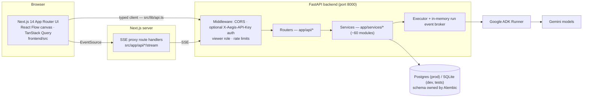
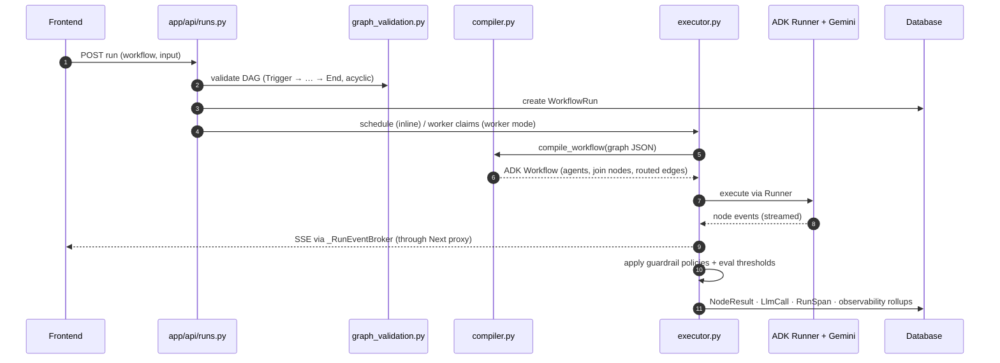
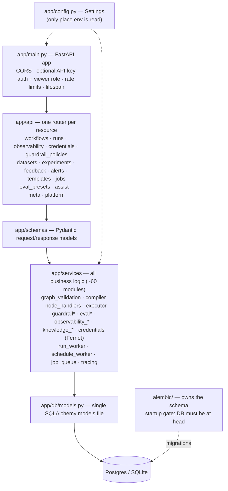
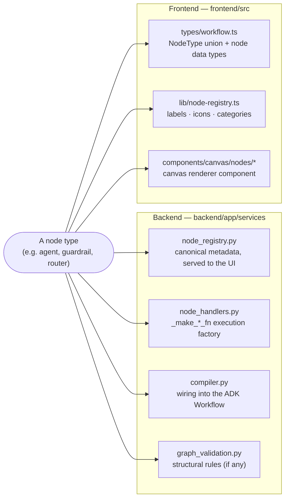
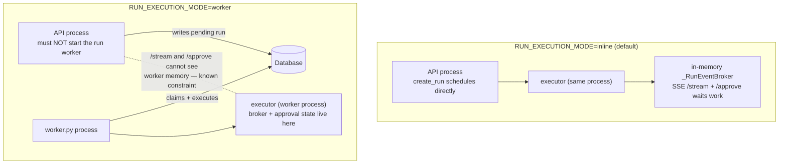
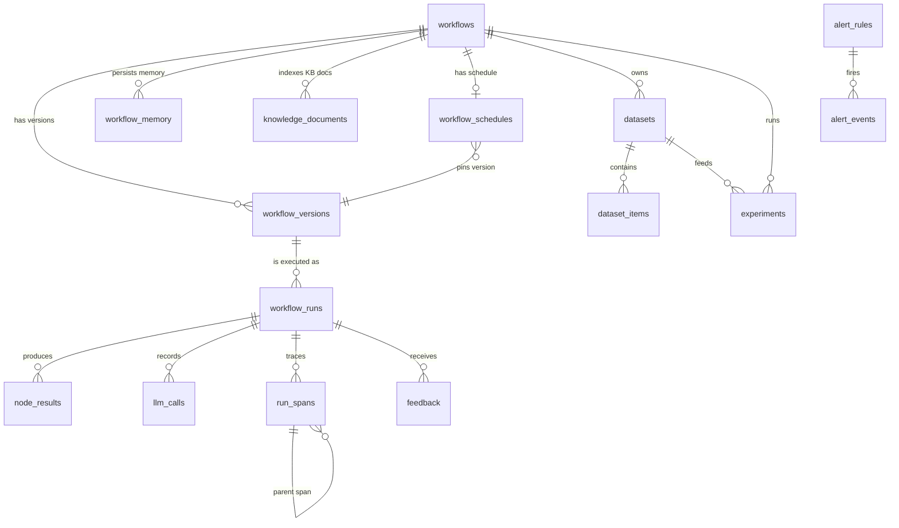

# Aegis — System Architecture

Aegis is a visual agent-workflow workbench: users compose graph workflows (LLM agents, tools,
routers, guardrails, evals) on a React Flow canvas, run them against real inputs via Google ADK +
Gemini, and operate them through an observability/triage surface. Two apps live in one repo:
`backend/` (FastAPI, Python 3.12) and `frontend/` (Next.js 14 App Router, TypeScript).

The diagrams below are Mermaid and render directly on GitHub.

## 1. System overview

The frontend never talks to Gemini and never touches the database — every call goes through the
typed client (`frontend/src/lib/api.ts`) to the FastAPI backend. Server-sent events (run stream,
observability stream) are proxied through Next.js route handlers under `src/app/api/*/stream/`
rather than hitting the backend directly.

## 2. Run pipeline (the core loop)

Workflow graphs are stored as JSON (`nodes` + `edges`). A run passes through three services in
order: **validation** (`graph_validation.py`, must be Trigger → … → End, acyclic, no orphan
edges), **compilation** (`compiler.py`, graph JSON → ADK `Workflow`; non-LLM node behaviors come
from `_make_*_fn` factories in `node_handlers.py`), and **execution** (`executor.py`, streams node
events to SSE subscribers through the in-memory `_RunEventBroker`, applies guardrail policies and
eval thresholds, and records observability rollups).

## 3. Backend layering

Strict layering: routers parse and authorize, schemas shape the payloads, services hold all
business logic, and a single SQLAlchemy models file talks to the database. All settings live in
`app/config.py` (`Settings`) — env vars are never read directly. The app deliberately does **not**
call `Base.metadata.create_all()` on startup; `app/services/startup.py` gates boot on the database
being at Alembic head.

## 4. Node type system (spans both apps)

Adding or changing a node type touches a fixed set of files that must stay in sync across the two
apps. The backend registry (`node_registry.py`) is canonical and is served to the UI.

The registry currently defines 28 node types across six categories:

| Category | Node types |
|---|---|
| `flow` (11) | trigger, end, input_schema, if, switch, filter, human_approval, sub_workflow, router, classifier, join |
| `data` (8) | transform, set_fields, code, memory_store, memory_retrieve, kb_retrieve, json_parse, delay |
| `llm` (4) | agent, summarizer, translator, extractor |
| `tools` (2) | tool, integration |
| `quality` (2) | evaluation, guardrail |
| `annotate` (1) | note (not executable) |

## 5. Execution modes and the single-process constraint

`RUN_EXECUTION_MODE=inline` (default) executes runs inside the API process. In `worker` mode a
separate `worker.py` process claims and executes runs — the API must not also start the run worker
(split-brain double-claim). SSE streams and human-approval waits live in in-memory state in the
executor, so in worker mode `/stream` and `/approve` served by the API cannot see them. This is a
known constraint; don't "fix" it casually. The schedule worker (cron-style triggers) runs in the
API lifespan in both modes.

## 6. Data model (key relationships)

A single SQLAlchemy models file (`app/db/models.py`, 24 tables). The core chain is
workflow → version → run → per-node observability records. Standalone tables not shown:
`observability_rollups`, `background_jobs`, `evaluation_presets`, `credentials` (Fernet-encrypted
secrets when `APP_ENCRYPTION_KEY` is set), `guardrail_policies`, `workflow_templates`, `audit_log`.

