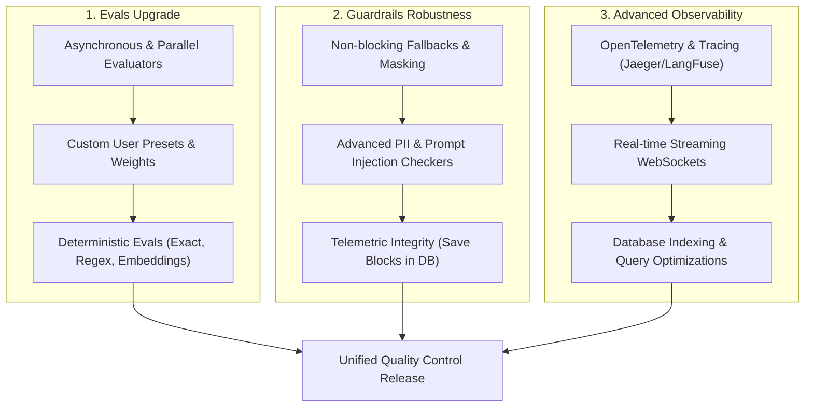

# Aegis Upgrade Plan: Evals, Guardrails & Observability

This document outlines structural, security, and feature improvements for the Aegis evaluation engine, guardrail handlers, and observability dashboard.

---

## 🗺️ Upgrade Roadmap & Architecture

---

## 1. Evaluation Engine Upgrades (`Evals`)

Currently, evaluations are strictly LLM-based, run sequentially within the main workflow thread, and use hardcoded presets.

### Proposed Enhancements:
1. **Parallel / Post-Run Evaluations:**
   - **Problem:** Running evaluations sequentially adds significant latency to the user-facing response.
   - **Solution:** Move evaluations out of the critical path. Execute them in parallel via `asyncio.gather` or process them asynchronously in a background task after dispatching the final workflow output.
2. **User-defined Custom Presets & Weighting:**
   - **Problem:** Preset criteria and dimension weights (RAG quality, tone, code safety) are hardcoded in the backend.
   - **Solution:** Introduce a new database model `EvaluationPreset` allowing users to configure custom evaluation criteria, custom grading dimensions (1-5 scale), and custom weighted calculations via the settings UI.
3. **Hybrid & Deterministic Evaluators:**
   - **Problem:** LLM-based grading is expensive, non-deterministic, and slow.
   - **Solution:** Add lightweight, deterministic evaluation nodes:
     - **Exact Match / Substring Match** (for unit testing classification models).
     - **Regex Matches** (for checking syntax, code patterns, and formats).
     - **Embedding Similarity** (using cosine similarity of Gemini text embeddings against a baseline answer).

---

## 2. Guardrail Robustness Upgrades (`Guardrails`)

Guardrails currently block the workflow or log a warning. The PII detector is basic, and blocked workflows fail to save execution logs for the failing node.

### Proposed Enhancements:
1. **Graceful Fallbacks & Mutation Actions:**
   - **Problem:** Failing guardrails completely halt execution or log a warning, with no option for mitigation.
   - **Solution:** Add configurable guardrail failure behaviors:
     - **Fallback Value:** Return a default safe string (e.g., "Sorry, I cannot process this response").
     - **PII Masking / Redaction:** Cleanse the output (e.g. replacing emails/phones with `[REDACTED]`) and continue the run.
     - **Alternate Routing:** Route the workflow execution to an alternate node branch on failure.
2. **Advanced PII & Safety Guardrails:**
   - **Problem:** PII detection uses static, error-prone regex patterns.
   - **Solution:** Implement advanced guardrail checkers:
     - **Presidio Integrations:** Connect Microsoft Presidio for robust, entity-based PII detection.
     - **Prompt Injection Shield:** Add an LLM-based input classifier to filter out adversarial prompt injection patterns.
3. **Database Telemetry Fix:**
   - **Problem:** Raising `GuardrailBlockedError` immediately aborts the loop, so the database never receives a `NodeResult` for the blocked guardrail node.
   - **Solution:** Catch the exception inside `_consume_events`, commit the failed node state to the database, and then safely cancel/fail the run.

---

## 3. Observability & Telemetry Upgrades

The current observability dashboard loads slowly, queries the entire workflow list on ticks, and relies on client-side polling.

### Proposed Enhancements:
1. **OpenTelemetry Tracing Integration:**
   - **Solution:** Export Aegis execution traces to standard APM/tracing platforms (e.g., Datadog, Jaeger, LangFuse, or LangSmith) using OpenTelemetry. Map ADK nodes to spans, and workflows to traces.
2. **Real-time WebSockets / SSE Updates:**
   - **Solution:** Replace client-side status polling on the dashboard with a single Server-Sent Events (SSE) or WebSocket connection for live-run progress tracking.
3. **Database Performance Indexing:**
   - **Problem:** The background scheduler query (`_scan_scheduled_workflows`) scans all versions of all workflows every 15 seconds.
   - **Solution:** 
     - Add composite indices on `workflow_runs(status, created_at)`.
     - Extract cron triggers to a separate `workflow_schedules` index to avoid parsing raw workflow graphs in memory.

---

## 📋 Implementation Timeline & Priority

| Phase | Component | Action Item | Priority | Estimated Complexity |
| :--- | :--- | :--- | :--- | :--- |
| **Phase 1** | **Guardrails** | DB telemetry fix for blocked nodes + `anyio.to_thread` for SMTP/Email | 🔴 High | 🟢 Low |
| **Phase 1** | **Evals** | Async parallel evaluation execution (`asyncio.gather`) | 🔴 High | 🟡 Medium |
| **Phase 2** | **Guardrails** | Fallback routing and PII Masking / Redaction actions | 🟡 Medium | 🟡 Medium |
| **Phase 2** | **Observability**| Database index optimization + Cron scheduler query optimization | 🟡 Medium | 🟡 Medium |
| **Phase 3** | **Evals** | Deterministic Matchers (Regex, Exact, Embedding Similarity) | 🟢 Low | 🟡 Medium |
| **Phase 3** | **Observability**| OpenTelemetry / LangFuse exporter middleware | 🟢 Low | 🔴 High |

> [!IMPORTANT]
> Priority is assigned to Phase 1 fixes because they resolve outstanding database telemetry bugs and performance blocks in the core execution flow.
